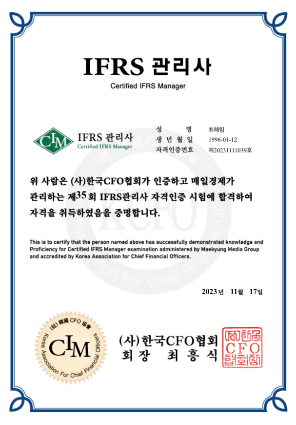
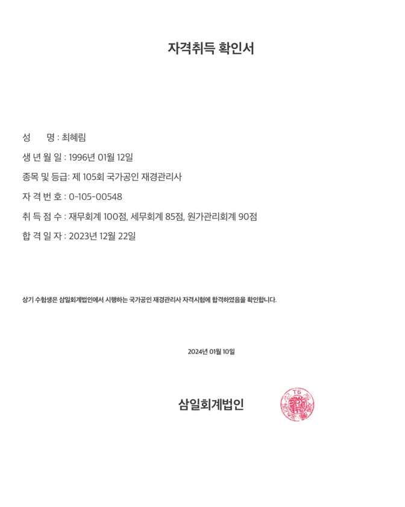

## 👤 About Me

<table>
  <tr>
    <td width="250" align="center">
      
    </td>
    <td>

| 항목         | 내용                                             |
|--------------|--------------------------------------------------|
| **이름**     | 최혜림 (Choi Hye-rim)                            |
| **생년월일** | 1996년 1월 12일                                  |
| **이메일**   | [chimo96@naver.com](mailto:chimo96@naver.com)   |
| **학력**     | 인하대학교 글로벌금융학과 졸업 (경제학 부전공)   |
| **졸업연도** | 2022년 2월                                       |
| **자격시험** | CPA시험 준비경험 있음 (불합격 후 실무 커리어 시작) |

</td>
  </tr>
</table>

<h2>📄 자격 / 어학 / 수상</h2>

<table style="border-collapse: collapse; width:100%; text-align:center; font-size:14px;">
  <thead>
    <tr>
      <th style="border: 1px solid #ccc; padding:6px;">구분</th>
      <th style="border: 1px solid #ccc;">IFRS 관리사</th>
      <th style="border: 1px solid #ccc;">재경관리사 (국가공인)</th>
    </tr>
  </thead>
  <tbody>
    <tr>
      <td style="border: 1px solid #ccc;">취득일</td>
      <td style="border: 1px solid #ccc;">2023.11</td>
      <td style="border: 1px solid #ccc;">2023.12</td>
    </tr>
    <tr>
      <td style="border: 1px solid #ccc;">발급기관</td>
      <td style="border: 1px solid #ccc;">한국CFO협회</td>
      <td style="border: 1px solid #ccc;">삼일회계법인</td>
    </tr>
    <tr>
      <td style="border: 1px solid #ccc;">평가</td>
      <td style="border: 1px solid #ccc;">S급</td>
      <td style="border: 1px solid #ccc;">
        재무회계 100점 
        세무회계 85점 
        원가관리회계 90점
      </td>
    </tr>
    <tr>
      <td style="border: 1px solid #ccc;">사본</td>
      <td style="border: 1px solid #ccc;"></td>
      <td style="border: 1px solid #ccc;"></td>
    </tr>
  </tbody>
</table>

📌 **기타 수상 이력**  
- 인하대학교 글로벌금융학과 **성적우수상 수상** (2019년 1학기, 4학년 수석)
  

---
## 🌏 교육 / 활동 경험

### **2019.01 | 인하대학교 해외지역연구 프로그램 (프랑스 릴 가톨릭대학교)**

- **3주간의 언어 및 문화 수업**을 통해 **타문화 협업 능력과 리더십**을 체득함  
- 팀 프로젝트를 수행하며 **의사소통 능력과 협업 태도**를 발전시킴  
- 프랑스 문화를 체험하며 **글로벌 시야**와 **문화 다양성 존중 태도**를 내면화  
- 한국 문화를 소개하며 **국제 커뮤니케이션 능력**을 함양함

> “짧지만 밀도 있는 해외경험을 통해 글로벌 감각과 협업역량을 키운 의미 있는 시간”

---

👩🏻‍💻 안녕하세요, 회계 자동화와 재무 프로세스 개선에 관심이 많은 실무형 회계 담당자 최혜림입니다.

이 페이지는 제가 직접 경험한 업무를 바탕으로 구성한 포트폴리오이자 기록 공간입니다.  
단순 반복 작업에 그치지 않고, 구조적인 이해를 바탕으로 **프로세스를 효율화**하고  
함께 일하는 사람들과의 **협업을 통해 실질적인 개선을 만들어내는 것**에 가치를 두고 있습니다.

> “작지만 의미 있는 변화”를 통해 팀과 조직에 긍정적인 임팩트를 남기는 것이 저의 지향점입니다.

