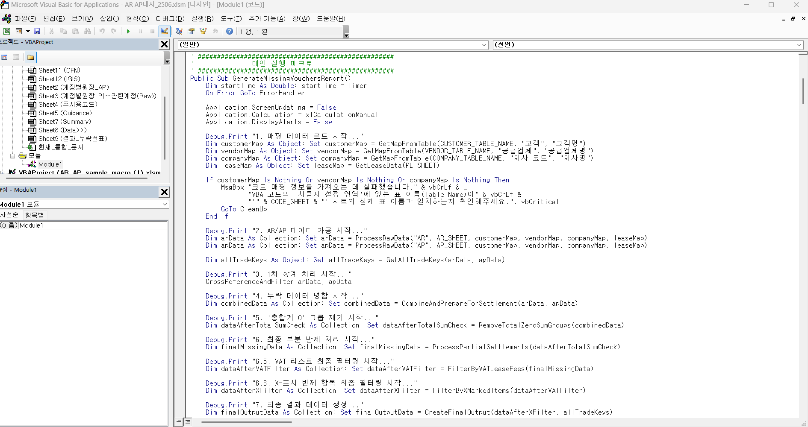
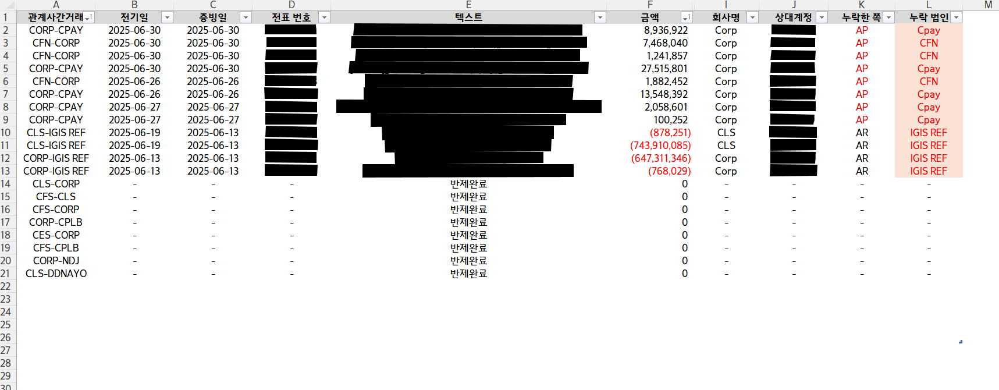
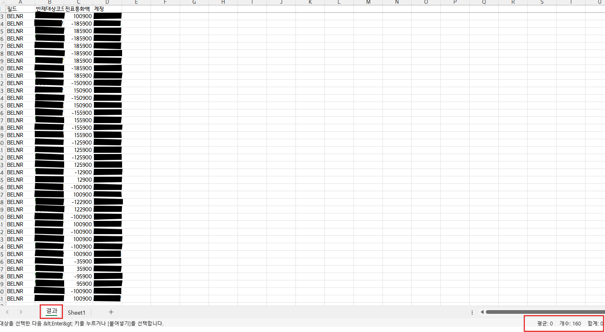

## ⚙️ 매크로 기반 자동화 사례 정리 (Macro Summary)

이 문서는 실제 업무에서 VBA를 활용하여 반복적이고 비효율적인 회계 프로세스를 자동화한 두 가지 주요 사례를 정리한 문서입니다.  
각 자동화는 Excel VBA 기반으로 구현되었으며, 월 결산 시 반복적으로 발생하는 수작업을 제거하고 업무 속도와 정확성을 개선하였습니다.

---

## 1. 관계사 간 AR/AP 대사 자동화  
**(Intercompany Reconciliation Automation)**

- **배경**: 관계사 간 거래 내역을 수기로 비교하면서 누락 전표를 확인하는 데 많은 시간이 소요됨  
- **문제점**:  
  - 회사코드 + 고객/공급업체 기준으로 수작업 필터링  
  - 전표별 금액 매칭, 누락 탐색에 수 시간 소요  
- **해결방안**:  
  - VBA로 아래 자동화 로직 구현:  
    - 거래처, 전표번호, 금액 기준 그룹핑  
    - 디테일한 조건을 부여하여 전표별 매칭 여부 판단  
    - 누락 전표만 필터링하여 리포트 출력  
- **성과**:  
  - 수작업 3~4시간 → 클릭 한 번, 약 1분 이내 결과 도출  
  - 누락 전표 정확도 상승, 검토 누락 방지

### 💻 자동화 화면 예시

|  |  |
|:---------------------------------------------:|:---------------------------------------------:|
| 누락전표 추출 로직의 VBA 모듈 화면(일부)       | 누락 전표 자동 리포팅 화면                    |

---

## 2. SAP 채권 반제 전표식별코드 자동 추출기  
**(Clearing Code Generator)**

- **배경**: SAP F-51 화면에서 거래처별 매출채권을 수동으로 선택하여 반제하는 비효율  
- **문제점**:  
  - 거래처 수 증가에 따라 수백 건의 전표를 수기로 클릭해야 함  
  - 전표 코드 입력 누락 및 실수 빈번  
- **해결방안**:  
  - Excel VBA로 SAP 전표 데이터를 분석하여 반제 대상 자동 식별  
  - 반제 대상 전표번호를 자동으로 텍스트 파일로 출력 (SAP 업로드 가능)  
- **성과**:  
  - 수동 입력 최소화 → 클릭 한 번으로 추출 완료  
  - 월 5시간 이상의 입력 시간 절감, 오류 발생률 대폭 감소

### 💻 자동화 화면 예시

|  |  |
|:---------------------------------------------------:|:--------------------------------------------------:|
| 반제 대상 추출 로직의 VBA 모듈 화면(일부)            | 반제 대상 전표 식별코드 결과 화면                   |

---

💬 **본 이미지는 실제 VBA 자동화 엑셀 파일에서 캡처한 화면이며, 민감한 정보(회사명, 금액, 전표번호 등)는 모두 블라인드 처리되었습니다.**

